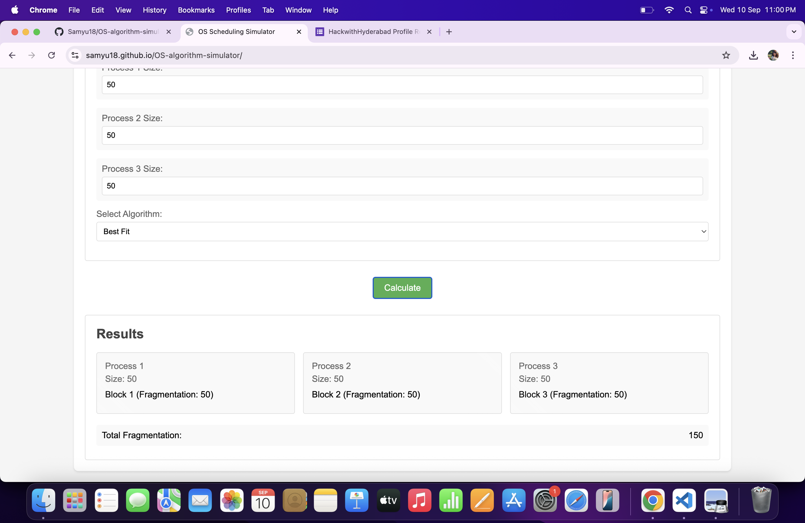

# 🚀 OS Algorithm Simulator

A **web-based simulator** for classic **Operating System algorithms**:

- **CPU Scheduling** (FCFS, SJF, Priority, Round Robin)
- **Disk Scheduling** (FCFS, SSTF, SCAN, C-SCAN, LOOK, C-LOOK)
- **Memory Management** (First Fit, Best Fit, Worst Fit, Paging, Page Replacement)

This project helps users visualize and interact with OS algorithms, making learning engaging and intuitive.

---

## 📸 Screenshots

| Home Page | Algorithm Dropdown | Disk - C-LOOK | Memory - Best Fit | CPU - Round Robin |
|-----------|-------------------|---------------|-------------------|-------------------|
|  |  |  |  |  |

---

## 📂 Project Structure

- `server.py` – Python backend server
- `index.html` – Main frontend page
- `script.js` – JavaScript logic for simulations
- `styles.css` – Frontend styling
- `requirements.txt` – Python dependencies

---

## ⚙️ How to Run

1. **Install dependencies**
    ```sh
    pip install -r requirements.txt
    ```
2. **Start the server**
    ```sh
    python server.py
    ```
3. **Open `index.html` in your browser**

---

## 🏆 Highlights

- Interactive web interface for algorithm visualization
- Python backend + static frontend (HTML, CSS, JS)
- Educational tool for understanding OS concepts

---

## 💡 Features

- **CPU Scheduling:** FCFS, SJF, Priority, Round Robin
- **Disk Scheduling:** FCFS, SSTF, SCAN, C-SCAN, LOOK, C-LOOK
- **Memory Management:** First Fit, Best Fit, Worst Fit, Paging, FIFO/LRU/Optimal Page Replacement

---

## 👩‍💻 Author

*Samyuktha Jakkula*

---

